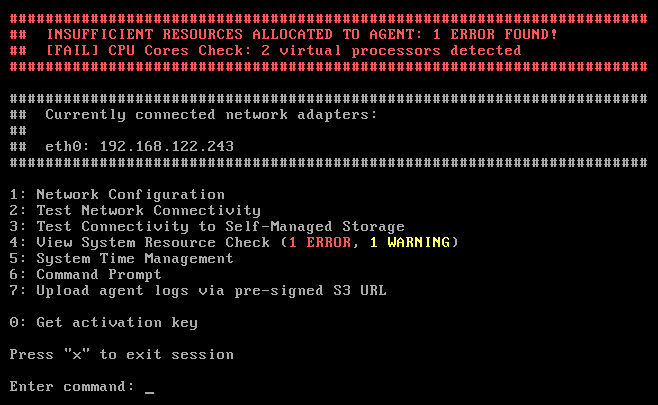
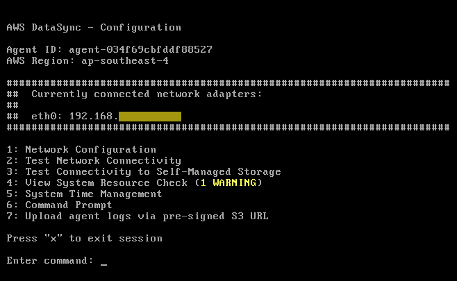
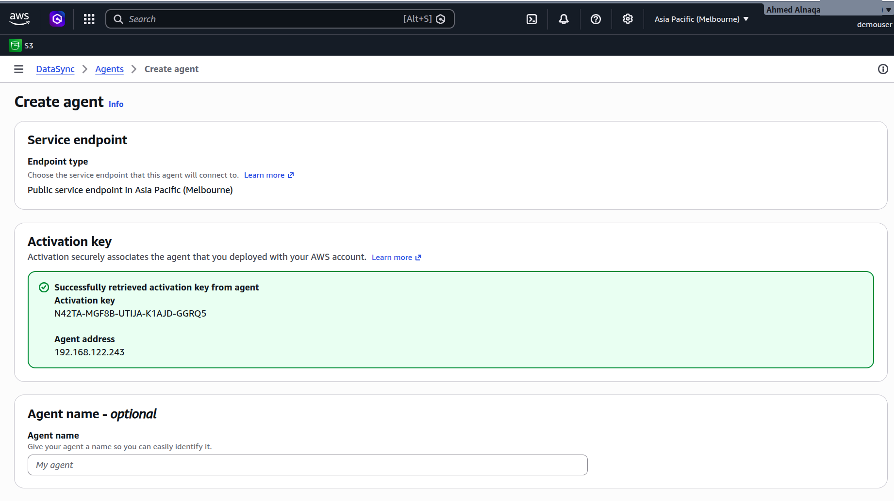
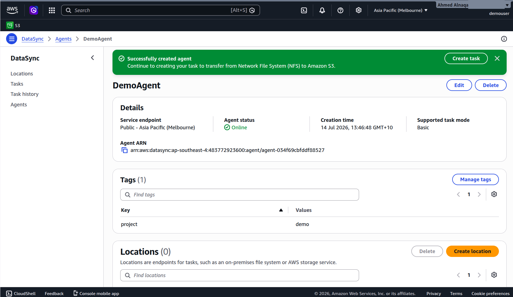

# On‑Premises to AWS S3 with DataSync (KVM Agent)

This project demonstrates how to automatically sync files from a local Linux  folder to an Amazon S3 bucket using **AWS DataSync** with a self‑deployed agent virtual machine running on **KVM**.

The setup is ideal for development, training, or small‑scale data pipelines where you want to evaluate DataSync without needing a dedicated VMware ESXi or Hyper‑V server.

---

## Why KVM?

When deploying the AWS DataSync agent on your own hardware, AWS provides three image formats:

- **VMware ESXi** (`.ova`) – requires a paid vSphere license and a dedicated server  
- **Microsoft Hyper‑V** – Windows‑only, not available on Linux   
- **KVM** (`.qcow2`) – native to Linux, free, lightweight, and fully supported on Linux 

**KVM (Kernel‑based Virtual Machine)** is built directly into the Linux kernel and turns your machine into a bare‑metal hypervisor. It’s perfect for a local lab because:

- No extra licensing costs
- Excellent performance (near‑native)
- Easy management via `virt-manager` (GUI) or `virsh` (CLI)
- The DataSync agent requirements (4 vCPUs, 8 GB RAM) are within reach of a modern laptop

###**If you later move to production, you can reuse the exact same agent image on a dedicated KVM server.**

---

## Project Architecture
[ Linux  Host ]
├── /home/(user_name)/data/ ← folder to watch (NFS exported)
├── KVM Virtual Machine (DataSync agent)
│ └── agent connects to NFS share
└── AWS DataSync task copies from NFS → S3 bucket

text

The flow:
1. Files are placed into `/home/(user_name)/data/` on the host.
2. The DataSync agent (running in the KVM VM) mounts this folder via NFS.
3. A DataSync task reads the NFS source and transfers new/changed files to S3.
4. The task can be triggered manually or by a local cron job (every 2 minutes).

---

## Prerequisites

- **Linux** (any recent version with KVM support)
- **AMD‑V / Intel VT‑x enabled** in BIOS (check with `kvm-ok`)
- At least **12 GB free RAM** (8 GB for the agent + 4 GB for the OS)
- An **AWS account** with permissions to create DataSync resources and write to an S3 bucket
- **AWS CLI v2** installed and configured (`aws configure`)
- A pre‑created S3 bucket (e.g., `s3://bronze-superstore-ds-demouser-...`)

---

## Step‑by‑Step Guide

#### 1. Verify virtualisation support

bash
sudo apt install cpu-checker -y
kvm-ok
Expected output: INFO: /dev/kvm exists – KVM acceleration can be used

If it says not available, reboot into BIOS/UEFI and enable AMD‑V or VT‑x.

#### 2. Install KVM, libvirt, and virt‑manager
bash
sudo apt update
sudo apt install qemu-kvm libvirt-daemon-system libvirt-clients virt-manager -y
Add your user to the libvirt group (to manage VMs without sudo):

bash
sudo adduser $USER libvirt
Log out and log back in (or reboot) for the group change to take effect.

#### 3. Download the DataSync agent image
Go to the AWS DataSync agent download page (change region if needed).
Under “Download the Enhanced mode image and deploy on your on‑premises KVM hypervisor” , download the .qcow2 file.

Move the downloaded file to libvirt’s default image folder:

bash
sudo cp ~/Downloads/aws-datasync-*.x86_64.xfs.gpt.qcow2 /var/lib/libvirt/images/
#### 4. Create the DataSync agent VM
Launch Virtual Machine Manager:

bash
virt-manager
Steps in the GUI:

Click “Create a new virtual machine” → “Import existing disk image” → Forward

Browse to the QCOW2 file in /var/lib/libvirt/images/

OS variant: Generic Linux

Memory: 8192 MB, CPUs: 4

Check “Customize configuration before install” and click Finish

In the configuration window, ensure:

Network is set to “Virtual network ‘default’: NAT”

CPU model = host-passthrough (recommended for AMD Ryzen)

Click Begin Installation (the VM will boot immediately)

#### 5. Find the agent’s IP address
Once the VM boots, its console will show a menu. Look for the line:
With prerequisite error:

After solve the errors:

text
Currently connected network adapters:
eth0: 192.168.122.243
Alternatively, from the host terminal:

bash
sudo virsh net-dhcp-leases default
#### 6. Activate the agent
Open a web browser on your Linux  host and go to:

text
http://<agent-IP>/
You will see the DataSync activation page.

In another browser tab, open the DataSync console and:

Click Create agent

Choose “Public service endpoint” (suitable for testing)

Click Get activation key

Copy the key and paste it into the agent’s web interface

Complete the activation; the agent will appear as Online in the console

#### 7. Share the local folder via NFS
The agent VM cannot see your host’s files directly – it must access them over the network.
We’ll set up an NFS server on Linux .

bash
sudo apt install nfs-kernel-server -y
mkdir -p /home/(user_name)/data

# Add export entry for the VM subnet
echo "/home/(user_name)/data 192.168.122.0/24(rw,sync,no_subtree_check,no_root_squash)" | sudo tee -a /etc/exports

# Apply the export and restart the NFS service
sudo exportfs -ra
sudo systemctl restart nfs-kernel-server
Verify with:

bash
sudo exportfs -v
You should see the /home/(user_name)/data export.

#### 8. Create DataSync source and destination locations
Source (NFS)
In the DataSync console → Locations → Create location → Network File System (NFS):

Agent: select your online agent

NFS Server: 192.168.122.1 (the host’s IP on the virtual network)

Mount Path: /home/(user_name)/data

Click Create location

Destination (S3)
Create another location → Amazon S3:

S3 bucket: your bucket name

IAM role: let DataSync create a default role (or use an existing one with write permissions)

Click Create location

#### 9. Create and run a DataSync task
Go to Tasks → Create task:

Source: your NFS location

Destination: your S3 location

Task name: OnPrem-To-S3

Configure options as needed (default: transfer all data, verify integrity)

Click Create

To run the task immediately: click Start → Run once.

#### 10. Monitor the task
You can monitor the execution in several ways:

AWS Console: Task execution history shows progress, bytes transferred, and any errors.

Agent web interface: http://<agent-IP>/ → View logs.

Agent console: Press 4 for system resource check, 7 to upload logs to S3.

AWS CLI (to check status):

bash
aws datasync list-task-executions --task-arn arn:aws:datasync:... --max-results 1
#### 11. (Optional) Schedule the task every 2 minutes
AWS DataSync’s built‑in scheduler has a minimum interval of 1 hour.

### Cost Estimation
DataSync: $0.015 per GB transferred (ap‑southeast‑4)

S3 storage: standard S3 rates apply (e.g., $0.023/GB/month)

KVM agent: no cost for the agent itself; only your local electricity 😄

For a small dataset of a few hundred MBs, the monthly cost remains negligible.

Alternative Lightweight Approach (inotify + AWS CLI)
If you do not need the full DataSync service and want a completely free, real‑time watcher -- > https://github.com/ahmedelnaqa/AWS/tree/main/S3-Auto-Uploader/Watch-folder , check out the companion script s3_sync.sh in this repository. It monitors a local folder and uses aws s3 cp immediately when a file is closed.
See s3_sync.sh for details.

Clean Up
To stop the agent and remove all resources:

bash
# Stop and delete the VM
sudo virsh destroy datasync-agent
sudo virsh undefine datasync-agent

# Remove the NFS export
sudo sed -i '/\/home\/(user_name)\/data/d' /etc/exports
sudo exportfs -ra

# Delete the DataSync agent and task from the AWS console
References
AWS DataSync Documentation

Deploying a DataSync agent on KVM

DataSync Pricing

libvirt / KVM on Ubuntu

License
MIT – use freely, adapt for your own pipelines.

text

---
