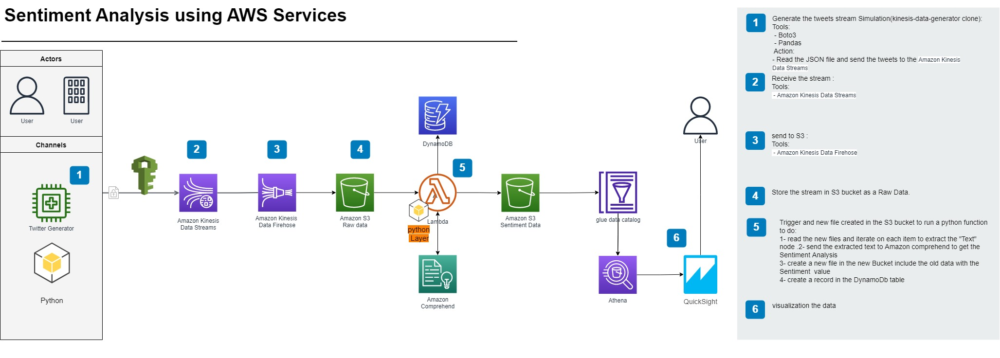

**Project Description:**
 This project demonstrates the use of sentiment analysis on Twitter tweets, utilizing AWS services to analyze the tweets. By leveraging AWS's powerful tools, the project can assess the sentiment of tweets, determining whether they are positive, negative, or neutral. This allows for large-scale, real-time analysis of Twitter data, providing valuable insights into public opinion and trends.

**Tools:**
 

 - AWS: 
	 - S3
	 - Kinesis Datastream
	 - Kinesis Firehose
	 - Lambda 
	 - Comprehend 
	 - DynamoDB 
	 - Glue
	 - QuickSight 
 - Python Boto

**Architecture:**

